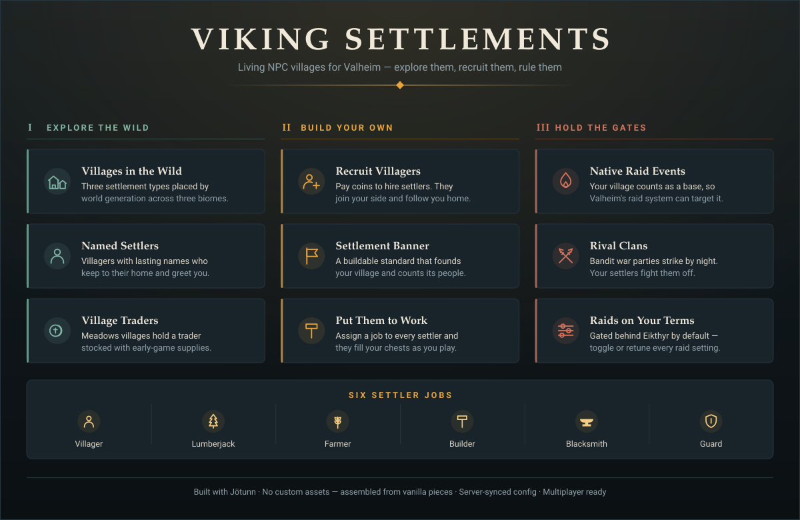

# VikingSettlements

A [Jötunn](https://github.com/Valheim-Modding/Jotunn)-based Valheim mod that
adds **inhabited NPC settlements** to world generation, lets you **recruit
settlers**, **found your own settlement**, **assign jobs**, and **defend it
from raids**.

<p align="center">
  
</p>

## Requirements

| Dependency | Version |
|---|---|
| Valheim | 0.221.4 or compatible |
| [BepInExPack Valheim](https://thunderstore.io/c/valheim/p/denikson/BepInExPack_Valheim/) | 5.4.2333+ |
| [Jötunn](https://thunderstore.io/c/valheim/p/ValheimModding/Jotunn/) | 2.29.2+ |

The mod is marked `EveryoneMustHaveMod` — **the server and every connecting
client need it installed at the same minor version**, or clients will be
rejected at connect.

## Installation

### With a mod manager (recommended)

Install [r2modman](https://thunderstore.io/c/valheim/p/ebkr/r2modman/) or the
Thunderstore app, create a Valheim profile, and install **BepInExPack Valheim**
and **Jötunn**. Then drop `VikingSettlements.dll` into the profile's
`BepInEx/plugins` folder (in r2modman: *Settings → Browse profile folder*).
Launch the game through the mod manager.

### Manual install

1. Install **BepInExPack Valheim** — extract the archive into your Valheim
   folder so that `winhttp.dll` and the `BepInEx` folder sit next to
   `valheim.exe`. Launch the game once to let BepInEx generate its folders,
   then quit.
2. Install **Jötunn** — copy `Jotunn.dll` into `<Valheim>/BepInEx/plugins/`.
3. Install this mod — copy `VikingSettlements.dll` into
   `<Valheim>/BepInEx/plugins/`.
4. Launch Valheim. On first run the mod writes its config to
   `<Valheim>/BepInEx/config/com.abjumb.vikingsettlements.cfg`.

Typical Valheim install locations:

| OS | Path |
|---|---|
| Windows | `C:\Program Files (x86)\Steam\steamapps\common\Valheim` |
| Linux | `~/.local/share/Steam/steamapps/common/Valheim` |
| macOS | `~/Library/Application Support/Steam/steamapps/common/Valheim` |

### Dedicated servers

Install BepInEx, Jötunn and `VikingSettlements.dll` on the server exactly as
above. World-generation settings (`Locations`, `Settlement`, `Raids`) are
admin-only and are synced from the server's config to clients, so set them
server-side; purely cosmetic client settings (chatter) stay local.

### Verifying it loaded

Open `<Valheim>/BepInEx/LogOutput.log` and look for these lines:

```
[Info   :VikingSettlements] VikingSettlements v1.1.0 loaded - settlements appear in newly generated world areas
[Info   :VikingSettlements] Created settlement NPC prefab VS_Settler
[Info   :VikingSettlements] Registered location VS_MeadowsVillage (... parts, quantity 60)
[Info   :VikingSettlements] Registered bandit raid with the native random event system
```

> **Settlements only appear in terrain the game has never generated before.**
> Installing the mod on an existing save will *not* add villages to areas you
> have already explored. Start a new world, sail somewhere new, or use the
> `vs_spawn` console command below.

## What the mod does

Three new location types are woven into Valheim's world generation:

| Location | Biome | Contents |
|---|---|---|
| `VS_MeadowsVillage` | Meadows | Longhouse, cabins, farm, maypole, watchtower, trader stall, fire plaza, 7 settlers + trader |
| `VS_ForestOutpost` | Black Forest | Watchtower, cabin, stake ring, campfire, 3 settlers |
| `VS_PlainsSteading` | Plains | Stone hall, barley/flax farm, watchtower, stake ring, 4 settlers |

Settlements are assembled procedurally from vanilla building pieces, so no
custom assets or asset bundles are required. Settler NPCs are cloned from
vanilla humanoids and re-purposed:

- Each settler gets a persistent personal name (derived from its network id,
  so all clients agree without extra syncing).
- Settlers stay in their settlement (their AI patrol point is pinned to
  their home), fight raiding monsters, and only turn on players if attacked.
  A config option can put them on the player faction instead.
- Settlers greet players who come close (client-side chatter).
- Meadows villages include a trader (cloned from Haldor) with a small store
  of early-game supplies.
- The ground under a settlement is levelled at spawn by a one-shot terrain op.

For already-explored areas there is a console command (enable `devcommands`
first):

```
vs_spawn [village|outpost|steading]
```

## Player settlements

> New here? **[Building Your First Settlement](docs/first-settlement.md)** walks
> through the whole thing step by step — what to bring, how to recruit, and the
> two mistakes that make settlers look broken.

You can found your own settlement and staff it with NPCs recruited from the
wild settlements:

1. **Recruit** — press `E` on a settler in any wild settlement and pay the
   coin cost (default 50). The settler switches to the player faction and
   follows you. `Shift+E` dismisses a follower.
2. **Found a settlement** — build the *Settlement Banner* (hammer → Misc,
   near a workbench; wood, fine wood and coins). The banner defines a
   settlement area (default 32 m radius) and shows its population on hover.
3. **Assign** — with a follower inside the banner's area, press `E` to settle
   them there. Press `E` again to cycle their job, `Shift+E` to unassign:
   - **Lumberjack** — periodically deposits wood into your settlement chests
   - **Farmer** — deposits carrots/turnips and the occasional honey
   - **Builder** — repairs damaged build pieces in the settlement
   - **Blacksmith** — smelts ore found in settlement chests (copper, tin,
     iron scraps; converts wood to coal otherwise)
   - **Guard** — sharper senses, holds position at the settlement
4. **Defend** — the banner emits a player-base area, so Valheim's native
   random event system can target your settlement: a custom raid event
   ("The clanless are raiding!") is registered alongside the vanilla ones
   (gated behind Eikthyr by default). Independently, rival clans roll a
   nightly chance to assault your settlement with bandit war parties, which
   your settlers — being on your faction — fight off natively.

Jobs need somewhere to put their output: place **chests inside the settlement
radius** or lumberjacks, farmers and blacksmiths will have nothing to work
with.

All settler state (recruiter, job, home) lives in the creature's ZDO, so it
persists across sessions and syncs to every client.

## Configuration

Edit `BepInEx/config/com.abjumb.vikingsettlements.cfg` (created on first run):

| Setting | Default | Description |
|---|---|---|
| Locations / MeadowsVillages | 60 | Placement attempts for meadows villages (0 disables) |
| Locations / ForestOutposts | 80 | Placement attempts for black forest outposts (0 disables) |
| Locations / PlainsSteadings | 50 | Placement attempts for plains steadings (0 disables) |
| Settlers / DefendPlayers | false | Wild settlers join the player faction and fight alongside you |
| Settlers / EnableTrader | true | Meadows villages include a trader |
| Settlers / Chatter | true | Settlers greet nearby players (client-side) |
| Settlers / ChatterIntervalSeconds | 25 | Minimum time between chatter lines |
| Recruiting / RecruitCostCoins | 50 | Coins to recruit a settler |
| Settlement / MaxSettlers | 10 | Max settlers per settlement banner |
| Settlement / SettlementRadius | 32 | Settlement area radius in meters |
| Settlement / WorkIntervalSeconds | 60 | Seconds between settler work ticks |
| Raids / EnableRaids | true | Enable the bandit raid event and rival clan raids |
| Raids / RaidsAfterFirstBoss | true | Raids only start once Eikthyr is dead |
| Raids / RivalRaidChancePerDay | 0.15 | Nightly chance of a rival clan raid per settlement |

Location counts only affect world generation, so changing them has no effect
on already-generated terrain.

## Building from source

You need the [.NET SDK](https://dotnet.microsoft.com/download) (8.0 or newer).

### With Valheim installed

```sh
git clone https://github.com/abjumb/VikingSettlements.git
cd VikingSettlements
dotnet build VikingSettlements.sln -c Debug
```

The Jötunn build props auto-detect a Steam install of Valheim, so this usually
works with no configuration. If it can't find your install, set a
`VALHEIM_INSTALL` environment variable, or create `Environment.props` in the
repo root (it is gitignored):

```xml
<?xml version="1.0" encoding="utf-8"?>
<Project ToolsVersion="Current" xmlns="http://schemas.microsoft.com/developer/msbuild/2003">
  <PropertyGroup>
    <VALHEIM_INSTALL>C:\Program Files (x86)\Steam\steamapps\common\Valheim</VALHEIM_INSTALL>
  </PropertyGroup>
</Project>
```

- **Debug** builds automatically deploy the plugin to
  `<VALHEIM_INSTALL>/BepInEx/plugins/VikingSettlements/` (override with a
  `MOD_DEPLOYPATH` environment variable) — build, launch, done.
- **Release** builds package a Thunderstore-ready zip at
  `VikingSettlements/VikingSettlements.zip` instead of deploying.
- Setting `DoPrebuild.props` to `true` has Jötunn publicize your game
  assemblies automatically on the next build.

### Without Valheim installed (CI / containers)

```sh
./scripts/fetch-libs.sh          # assembles reference assemblies under vendor/
dotnet build VikingSettlements.sln -c Release
```

`fetch-libs.sh` downloads publicized game assemblies (ValheimGameLibs, NuGet),
UnityEngine reference modules (NuGet) and BepInEx 5 (GitHub releases), lays
them out like a Valheim install under `vendor/valheim`, and writes
`Environment.props` so the Jötunn build props pick them up. Don't run it if
you have a real install — you want to build against the real assemblies.

## Testing in game

Enable the console with `F5` and type `devcommands` first; everything below
needs it.

To keep iteration bearable, temporarily set `WorkIntervalSeconds = 10` and
`RivalRaidChancePerDay = 1.0` in the config so you aren't waiting on timers.

| What to test | How |
|---|---|
| Wild settlements | `vs_spawn village` (also `outpost`, `steading`) — check buildings sit on the ground and settlers are alive |
| Recruiting | `spawn Coins 200`, walk up to a settler, look for the "Recruit" hover text, press `E` |
| Settlement banner | `spawn Wood 50`, `spawn FineWood 20`, stand near a workbench, hammer → Misc |
| Jobs | Assign a settler, place a chest in the radius, set them to Lumberjack, wait a tick |
| Native raid event | `setkey defeated_eikthyr`, then `event vs_banditraid` (`stopevent` to end it) |
| Rival clan raid | With chance at 1.0, `skiptime` until night while standing in your settlement |

If a feature is silently missing, check `BepInEx/LogOutput.log` — every vanilla
prefab the mod cannot find is logged as a `not found, skipped` warning rather
than throwing.

## Project layout

```
VikingSettlements/
├── VikingSettlements.cs        # plugin entry point, config + manager wiring
├── ModConfig.cs                # BepInEx config entries (server-synced)
├── Npcs/
│   ├── SettlerPrefabs.cs       # clones vanilla humanoids into settler/trader/raider prefabs
│   ├── SettlerIdentity.cs      # deterministic personal names
│   ├── SettlerChatter.cs       # proximity greetings
│   ├── SettlerHome.cs          # pins AI patrol point to the settlement
│   ├── SettlerRecruitable.cs   # recruit/follow/assign state machine + job cycling
│   ├── SettlerWork.cs          # job effects (produce, smelt, repair)
│   └── RaiderDespawn.cs        # cleans up unbeaten raiders
├── Settlements/
│   ├── PlayerSettlement.cs     # banner behavior: population, rival raid rolls
│   └── SettlementPieces.cs     # buildable Settlement Banner piece
├── Raids/
│   ├── RaidEvents.cs           # native RandEventSystem integration
│   └── RaidSpawner.cs          # rival clan war parties
├── World/
│   ├── SettlementLayout.cs     # data-driven blueprint DSL
│   ├── Layouts.cs              # the actual settlement blueprints
│   ├── LayoutBuilder.cs        # instantiates blueprints (locations & command)
│   └── SettlementLocations.cs  # ZoneManager registration
└── Commands/
    └── SpawnSettlementCommand.cs
```

All vanilla prefab references are resolved defensively — after a game update
a renamed prefab logs a warning and is skipped instead of breaking world
loading.

## Known limitations

- Settlement structures are placed on Valheim's build grid from code; exact
  piece pivots can only be fine-tuned in game, so expect some rustic
  imperfections in roofs and gables.
- Settlers use dvergr models (the closest vanilla friendly humanoids with
  full combat AI). Custom player-model settlers would need a Unity asset
  bundle, which this repo's Unity project supports as a follow-up.
- Killed settlers do not respawn — settlements can be wiped out by raids.

## Debugging

See the Wiki page [Debugging Plugins via IDE](https://github.com/Valheim-Modding/Wiki/wiki/Debugging-Plugins-via-IDE)
for more information.

## Credits

Built on [Jötunn](https://github.com/Valheim-Modding/Jotunn), the Valheim
modding library. The build tooling and Unity project scaffolding originally
came from the [JötunnModStub](https://github.com/Valheim-Modding/JotunnModStub)
template (MIT No Attribution) and have since been reworked for this project.

## License

Released under the [MIT License](LICENSE).
